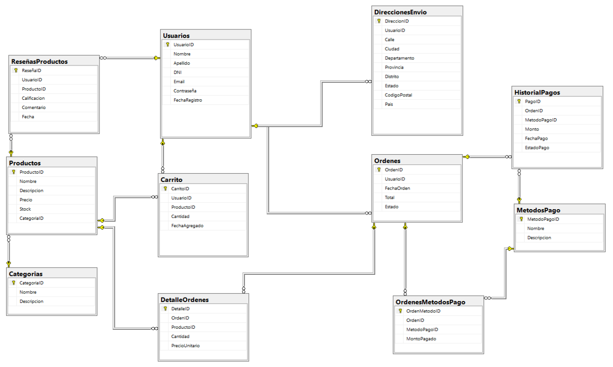

# Informe Técnico: Avance 1 del Proyecto Integrador
*Confeccionado por: Alejandro N. Herrera Soria*
*- La Rioja (AR), 23 de Julio de 2025*

**Proyecto:** Optimización de una plataforma para un comercio electrónico con modelado dimensional y DBT.
**Fase:** Avance 1 - Carga y Entendimiento de los Datos.

Este documento presenta de manera consolidada el trabajo realizado, los hallazgos obtenidos y las decisiones tomadas durante la primera fase del proyecto, siguiendo la estructura de los puntos de trabajo (PI) propuestos.

### PI 1: Configuración del Entorno de Trabajo

**a. Instalación y Configuración del SGBD:**
Se ha configurado un entorno de base de datos relacional robusto. Aunque la consigna sugería PostgreSQL, los scripts de datos proporcionados (`.sql`) utilizaban una sintaxis T-SQL, específica de Microsoft SQL Server (ej. `GO`, `IDENTITY(1,1)`, `NVARCHAR`). Para garantizar la compatibilidad y evitar la traducción de scripts, se tomó la decisión técnica de instalar y configurar **SQL Server 2022 Developer Edition** junto con su herramienta de gestión **SQL Server Management Studio (SSMS)**. El entorno está completamente funcional.

**b. Creación de Base de Datos y Conexión ORM:**
Se creó exitosamente la base de datos de trabajo denominada `EcommerceDB`. Se desarrolló un script en Python que utiliza la librería `SQLAlchemy` (un Object-Relational Mapper - ORM) y `pyodbc` para establecer una conexión programática con la base de datos. Esta conexión ha sido verificada y se utiliza para la automatización de la carga y la ejecución de análisis exploratorios.

### PI 2: Carga Inicial de Datos

**a. Creación de Tablas e Importación de Datos:**
Se ejecutó el script `1.Create_ddl.sql` para crear la estructura completa de 11 tablas del modelo transaccional. Posteriormente, se desarrolló un script de carga en Python que procesa los 11 archivos `.sql` restantes en un orden lógico que respeta las restricciones de llaves foráneas. Este script es resiliente: maneja errores de integridad de datos (reportándolos como advertencias sin detener la carga) y problemas de formato de fecha, asegurando una carga máxima de datos válidos.

**b. Ajuste de Tipos de Datos:**
Los tipos de datos fueron definidos en el script DDL (`DECIMAL(10,2)`, `INT`, `NVARCHAR`, `DATETIME`, etc.) y se respetaron durante todo el proceso de carga. Esto preserva la integridad semántica de cada campo.

### PI 3: Tratamiento de Campos Semi-estructurados

**a. Identificación de Columnas:**
El análisis exploratorio identificó la tabla `DireccionesEnvio` como la fuente principal de datos semi-estructurados. El problema detectado es más profundo que una simple concatenación: existe una **corrupción sistémica de la relación entre Ciudad y Provincia**. Por ejemplo, se encontraron registros de "Ushuaia" en la provincia de "Buenos Aires", lo cual es geográficamente incorrecto.

**b. Aplicación de Técnicas de Limpieza:**
La decisión, alineada con las buenas prácticas de ingeniería de datos (ELT), es **no modificar los datos en la base de datos fuente**. La limpieza y estructuración de estos campos se realizará en la fase de transformación (Avance 3), donde se creará una dimensión `DimGeography` validada contra una fuente de verdad externa.

### PI 4: Análisis Exploratorio y Evaluación de Calidad de Datos

**a. Exploración con SQL y Python (ORM):**
Se utilizó tanto SSMS para consultas directas como un script de Python con SQLAlchemy y Pandas para un análisis más profundo y documentado.

**b. Detección de Inconsistencias:**
Se detectaron múltiples problemas críticos de calidad de datos:

* **Valores Nulos:** No se encontraron nulos en campos clave como `Productos.Descripcion`, pero sí en campos no críticos de `DireccionesEnvio`.

* **Duplicados:** No se encontraron duplicados en campos que deberían ser únicos como `Usuarios.DNI` o `Usuarios.Email`.

* **Inconsistencias Graves:**

    1.  **Imposibilidad de Cargar Datos de Ventas:** A pesar de que los datos de detalle de órdenes existen en los archivos fuente, la tabla `DetalleOrdenes` resultó con **0 registros cargados**. La investigación manual confirmó que esto se debe a que los registros de detalle intentan hacer referencia a un `OrdenID` que no existe en la tabla de Órdenes. Esto representa un problema de **integridad referencial masivo (datos huérfanos)** que impide el análisis de ventas.

    2.  **Inconsistencia Financiera:** Discrepancias significativas entre el `Total` de las órdenes y la suma de los pagos en `HistorialPagos`.

    3.  **Corrupción Geográfica:** Relaciones incorrectas entre ciudades y provincias.

    4.  **Flujo de Pagos Incompleto:** La mayoría de los pagos están atascados en estado "Procesando".

**c. Identificación de Claves y Atributos:**
Se validaron las llaves primarias y foráneas definidas en el DDL. Se identificaron como atributos clave para el negocio los campos relacionados con ventas (`Total`, `Cantidad`, `PrecioUnitario`), clientes (`UsuarioID`), productos (`ProductoID`) y tiempo (`FechaOrden`).

**d. Propuesta de Acciones:**
Se ha propuesto un plan de acción detallado para cada inconsistencia encontrada, que se documenta en el siguiente punto.

### PI 5: Reporte de Hallazgos

**a. Principales Insights y Problemas Encontrados:**
El principal hallazgo es que la base de datos, aunque estructuralmente bien definida, sufre de problemas de calidad de datos severos que impiden un análisis fiable. El problema más bloqueante es la **imposibilidad de cargar los datos de ventas (`DetalleOrdenes`) por inconsistencias de integridad**, seguido de la corrupción de datos geográficos y las inconsistencias financieras.

**b. Decisiones Tomadas Respecto a Limpieza y Transformación:**

* **Sobre `DetalleOrdenes`:** Se debe notificar al área de negocio sobre la existencia de datos de ventas huérfanos que no pueden ser asociados a ninguna orden válida. Para el modelado, se asumirá que es un error en la extracción de datos y que las futuras cargas contendrán detalles con referencias válidas.

* **Sobre Datos Geográficos:** Se creará una dimensión `DimGeography` a partir de una fuente externa fiable para limpiar y estandarizar las direcciones.

* **Sobre Inconsistencias Financieras:** La columna `Total` de la tabla `Ordenes` se considerará no fiable. El ingreso real (`revenue`) se calculará siempre a partir de la suma de los productos en `DetalleOrdenes` (`Cantidad * PrecioUnitario`), una vez que estos puedan ser cargados correctamente.

* **Sobre el Flujo de Pagos:** Los estados ("Procesando", "Fallido", etc.) se mantendrán como están, ya que representan un insight valioso sobre la eficiencia del sistema de pagos.

* **Sobre Datos Huérfanos:** Todos los registros huérfanos serán excluidos durante el proceso de transformación al no poder realizar un `JOIN` exitoso con sus tablas maestras correspondientes.

**c. Tablas Finales Resultantes y Relaciones:**
Las tablas finales de este avance son las 11 tablas del modelo transaccional cargadas en la base de datos `EcommerceDB`. El siguiente diagrama de base de datos, generado desde SSMS, muestra sus relaciones.

