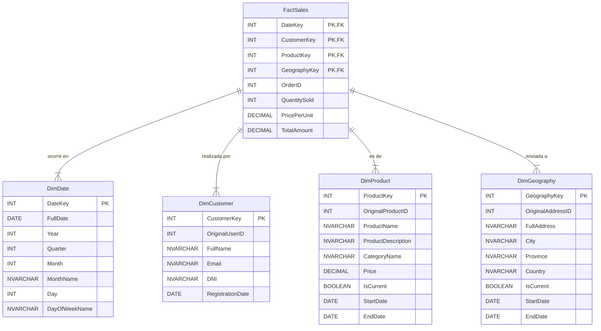

# Informe de Avance 2: Diseño del Modelo de Datos
*Confeccionado por: Alejandro N. Herrera Soria*
*- La Rioja (AR), 23 de Julio de 2025*

Este documento detalla el proceso de diseño del modelo dimensional para el proyecto, abarcando el análisis de requisitos, la identificación de componentes, el diseño lógico con estrategias de SCD y la documentación final del modelo.

### PI 1: Análisis de Negocio y Descubrimiento de Requisitos

**a. y b. Análisis de Preguntas de Negocio:**
El objetivo fundamental del negocio es pasar de tener datos crudos a obtener *insights* accionables. Basado en el contexto de un e-commerce y los datos disponibles, las preguntas clave a responder son:

* **Rendimiento de Ventas:** ¿Cuáles son nuestros ingresos por día, mes y año? ¿Cómo se comparan las ventas con el período anterior?
* **Análisis de Producto:** ¿Qué productos y categorías generan más ingresos? ¿Cuáles son los productos más vendidos en términos de unidades?
* **Análisis de Cliente:** ¿Quiénes son nuestros clientes más valiosos (los que compran más y más a menudo)?
* **Análisis Geográfico:** ¿Desde qué ciudades y provincias se realizan la mayor cantidad de pedidos? ¿Dónde se concentran nuestros ingresos?

**c. Entendimiento de Datos y Requisitos:**
Nuestro análisis en el Avance 1 reveló que, si bien tenemos datos para responder a estas preguntas, su calidad es un obstáculo.
* **El "qué" (Producto) y el "quién" (Cliente):** Los datos existen en las tablas `Productos` y `Usuarios`.
* **El "cuándo" (Fecha):** La `FechaOrden` en la tabla `Ordenes` es nuestra fuente principal para el análisis temporal.
* **El "dónde" (Geografía):** Los datos de `DireccionesEnvio` son críticos, pero descubrimos que están **sistémicamente corruptos**, lo que hace imposible un análisis geográfico fiable sin una limpieza profunda.
* **Las "métricas" (Ventas):** Los datos de `DetalleOrdenes` son la única fuente de verdad para calcular los ingresos, pero **no pudieron ser cargados** por problemas de integridad referencial.

**Conclusión de Requisitos:** El modelo dimensional no solo debe responder a las preguntas, sino que debe ser diseñado para **resolver activamente los problemas de calidad de datos** que hemos identificado.

---

### PI 2: Identificación de Componentes del Modelo Dimensional

Siguiendo la metodología Kimball, identificamos los componentes de nuestro primer modelo en estrella.

**a. Identificación de Hechos (Medidas):**
El proceso de negocio a modelar es **Ventas**. Las métricas cuantitativas que el negocio quiere medir (los hechos) son:
* `CantidadVendida`: Número de unidades de un producto en una línea de orden.
* `PrecioPorUnidad`: Precio del producto en el momento de la venta.
* `MontoTotal`: El cálculo de `CantidadVendida * PrecioPorUnidad`. Este será nuestro hecho principal y es totalmente aditivo.
* `MontoDescuento`: Un campo para futuras implementaciones, actualmente asumido como 0.

**b. Determinación de Dimensiones (Filtros y Agrupaciones):**
Las dimensiones son los contextos que dan sentido a los hechos. Son el "quién, qué, cuándo y dónde" de cada venta.
* **Dimensión Cliente (`DimCustomer`):** Describe al cliente que realiza la compra. (Fuente: `Usuarios`).
* **Dimensión Producto (`DimProduct`):** Describe el producto que se vende. (Fuentes: `Productos`, `Categorias`).
* **Dimensión Tiempo (`DimDate`):** Describe la fecha exacta de la venta, permitiendo agrupaciones por día, mes, año, etc. (Fuente: Se generará desde cero).
* **Dimensión Geografía (`DimGeography`):** Describe la ubicación de envío del pedido. (Fuente: `DireccionesEnvio`, tras una limpieza exhaustiva).

---

### PI 3: Diseño del Modelo de Datos

**a. Diseño Conceptual y Lógico:**
Optamos por un **Esquema en Estrella (Star Schema)**. Este diseño es el estándar de la industria para el modelado dimensional por su simplicidad y alto rendimiento en consultas analíticas. Consiste en una tabla de hechos central (`FactSales`) conectada directamente a múltiples tablas de dimensiones. Este diseño es intuitivo para los analistas de negocio y optimiza la velocidad de los `JOINs`.

**b. Modelado de Slowly Changing Dimensions (SCDs):**
Es crucial decidir cómo manejar los cambios en los atributos de las dimensiones a lo largo del tiempo para mantener la precisión histórica.

* **`DimCustomer` - Estrategia SCD Tipo 1 (Sobrescribir):**
    * **Atributos:** `Nombre`, `Apellido`, `DNI`, `Email`.
    * **Justificación:** Si un cliente corrige su nombre o DNI, no nos interesa mantener un registro del error anterior. Simplemente queremos tener el dato correcto. Por lo tanto, se sobrescribe el registro existente. Es la estrategia más simple y adecuada para corrección de errores o cambios que no tienen valor analítico histórico.

* **`DimProduct` - Estrategia SCD Tipo 2 (Añadir Fila Nueva):**
    * **Atributos a rastrear:** `Precio`, `Nombre`, `Descripcion`, `Categoria`.
    * **Justificación:** El precio de un producto o su categoría pueden cambiar con el tiempo, y estos cambios son **analíticamente importantes**. Queremos saber cuántas unidades se vendieron de un producto *cuando costaba $100* y cuántas se vendieron *cuando costaba $120*. Para lograr esto, no sobrescribimos el registro del producto. En su lugar, invalidamos el registro antiguo (marcando `IsCurrent = 'No'` y `EndDate`) y creamos una nueva fila con los datos actualizados (`IsCurrent = 'Yes'`). Cada venta en la tabla de hechos apuntará a la versión del producto que era válida en ese momento.

* **`DimGeography` - Estrategia SCD Tipo 2 (Añadir Fila Nueva):**
    * **Atributos a rastrear:** `Calle`, `Ciudad`, `Provincia`, `Pais`, `CodigoPostal`.
    * **Justificación:** Al igual que con los productos, la dirección de un cliente puede cambiar. Si un cliente se muda, es vital para el análisis geográfico que las ventas antiguas sigan asociadas a su ubicación anterior y las nuevas a la actual. Se aplicará la misma técnica que en `DimProduct`, creando un nuevo registro de dirección para el mismo cliente y manteniendo el historial.

---

### PI 4: Documentación y Comunicación del Modelo

**a. y b. Diagrama Entidad-Relación (ER) y Documentación:**
El siguiente diagrama ER visualiza el modelo lógico propuesto, incluyendo las columnas clave y las relaciones.

**c. Justificación de Decisiones de Diseño:**

* **Modelo en Estrella:** Se eligió por su simplicidad, rendimiento y facilidad de uso para los analistas. Evita los `JOINs` complejos de un modelo normalizado.
* **Tabla de Hechos Atómica:** La granularidad de "línea de producto por orden" es la más atómica posible. Esto proporciona la máxima flexibilidad analítica, permitiendo agregar los datos a cualquier nivel superior (por orden, por día, por cliente, etc.).
* **Llaves Sustitutas (Surrogate Keys):** Cada dimensión tiene una llave primaria simple y numérica (`CustomerKey`, `ProductKey`, etc.) que es independiente de los datos de origen. Esto nos protege de cambios en los IDs originales y es fundamental para implementar correctamente las SCD de Tipo 2.
* **Estrategias SCD:** La elección de SCD Tipo 1 para `DimCustomer` y SCD Tipo 2 para `DimProduct` y `DimGeography` es una decisión deliberada para equilibrar la simplicidad con la necesidad de mantener un historial preciso para los atributos que tienen un impacto analítico significativo.
* **Dimensión de Fecha (`DimDate`):** Se crea una dimensión de fecha dedicada y pre-calculada. Esto es mucho más eficiente que calcular atributos de fecha (como mes, trimestre, etc.) sobre la marcha en cada consulta y permite crear jerarquías de tiempo complejas.

Con este diseño, hemos sentado las bases para un Data Warehouse robusto, performante y capaz de responder a las necesidades críticas del negocio, al mismo tiempo que se abordan los problemas de calidad de datos descubiertos en la fase anterior.

